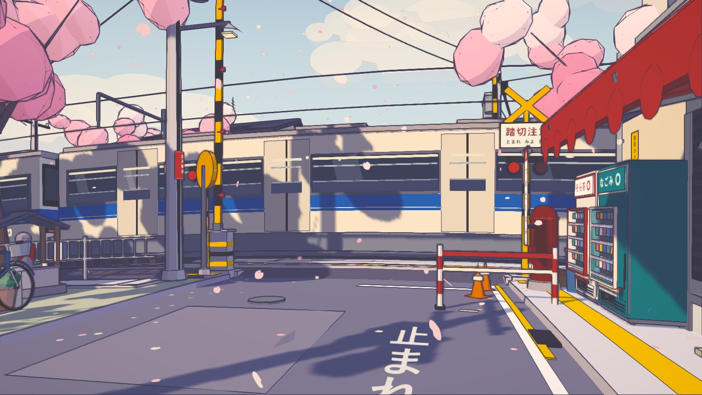
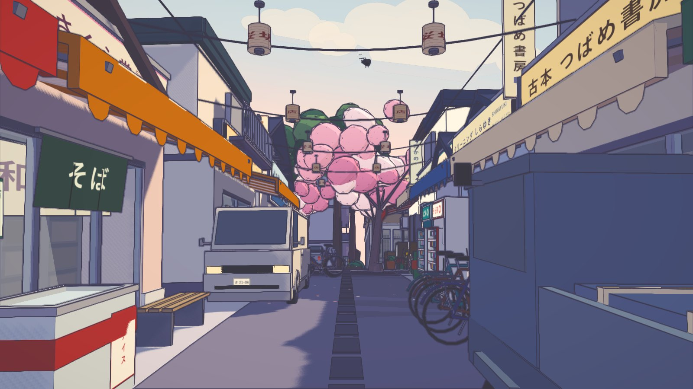
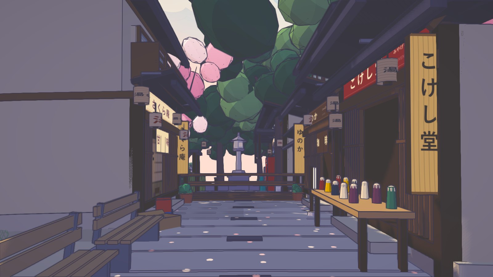
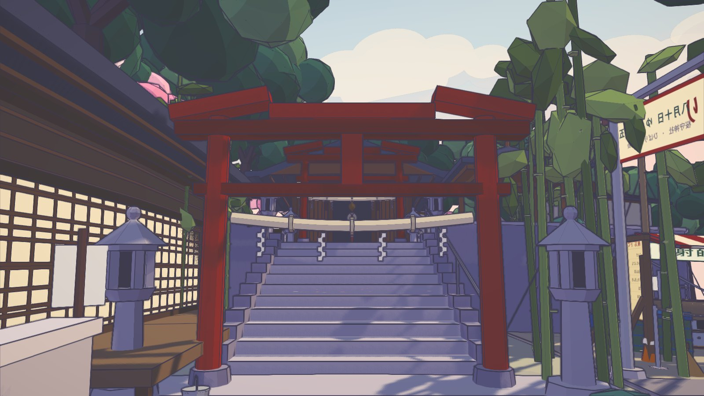

# Sakura Crossing — 桜踏切

An explorable Japanese suburban neighbourhood in blossom season, built as a real
3D scene in Three.js and rendered to look like a hand-painted 2D animation
background.



| | |
|---|---|
|  |  |
|  | Every sign, fascia, lantern and price strip above is **drawn at runtime with Canvas2D** — there is not one image asset in `src/`. The lines are a screen-space second difference of depth, not an edge filter. See [How the 3D-to-2D look is built](#how-the-3d-to-2d-look-is-built). |

It starts at a level crossing and grows outward from there: a shopping street, a
community shrine up a flight of stone steps, a high school on the rise behind the
station, a pedestrian overbridge, a branch library, a residential lane, two back
alleys, a summer-festival ground caught mid-preparation, a community-bus
turnaround at the far corner where the estate runs into a hillside, and the
housing in between — with a drainage channel running the width of the town
between two arms of a range of low hills, and a railway that goes the whole way
round the planet and through the hills twice on its way. There are no people anywhere in it, and there are not meant
to be — everything the place has to say about itself is said by what has been
left out, pinned up, parked or forgotten.

Needs Node 18 or newer, and nothing else — three.js and Vite are the only two
dependencies.

```bash
npm install
npm run play     # build + serve the production bundle, port 5179 — just want to play
npm run dev      # dev server with HMR, port 5178 — for working on it
```

Then open the printed URL and click to explore. Keep the terminal open; closing
it stops the server. A plain `file://` open will not work — the project is ES
modules, so it needs to be served over HTTP.

| key | |
|---|---|
| `W A S D` | walk |
| `Shift` | run |
| mouse | look |
| `E` | interact — and get on / off the e-bike |
| `V` | call up the e-bike (again to send it away, or to call it back to you) |
| `P` | orbit out and look at the whole planet |
| `M` | music on / off |
| `C` | show coordinates (flat x/z/y, yaw, and a ready-made camera line) |
| `Shift`+`C` | copy that line to the clipboard (or click the readout) |
| `R` | return to the opening view |
| `H` | hide / show the hint line |
| `Esc` | release the cursor |
| `O` / `G` | toggle the ink pass / the colour grade (to see what they do) |

The background-music playlist shuffles the tracks in `public/audio/`, plays each
one once per round, then reshuffles without repeating the last track. Browsers
block autoplay, so it starts on the click that
takes the pointer lock — not on load — fades in over three seconds, and pauses
while the tab is in the background.

**Only one track ships with the repository**, because the rest of the playlist
this was developed against is commercial music that cannot be redistributed.
To use your own: drop files into `public/audio/` and list the filenames in
`TRACKS` at the top of [`src/core/audio.js`](src/core/audio.js). Everything in
that folder is git-ignored except the shipped track, so a personal collection
cannot be committed by accident. An empty playlist is a supported state — the
world just runs in silence.

Interactables: **twenty-two** things answer `E` — nineteen vending machines
dispense a can (two of them スーパー さかえ's), the shop shutter rolls up and
down, the cat stretches, and the relay box on the far corner calls a train.
Otherwise a train comes through on its own every 35–45 seconds — bells and lamps
first, then the booms, then the train.

**電動バイク.** `V` stands one in front of you — a 原付, the same machine twelve
of which are parked around the town, painted a warm coral so you can find it at
forty metres. Look at it and `E` gets you on. Riding is the same first-person
camera dropped onto the seat: the speedometer, the mirrors and the bar-ends are
in frame, `W` opens the throttle to **7.65 m/s — one and a half times a run**,
`S` brakes and then reverses at a walk, `A` and `D` steer rather than strafe (the
mouse still steers too), and the machine banks into its turns with the horizon.
`E` gets you off beside it and it stays where you left it, on its stand, in the
way; `V` calls it back if it is more than four metres off, and puts it away if it
is not. It is the only thing in this world with wheels that moves other than the
train — and the only reasonable way to get from the crossing to ひばり山's
展望台 and back.

Where to walk: the crossing is the hub. South-east through the alley beside the
corner shop is the shopping street; keep going north up it, past two Showa
shopfronts, and you come out on the north lane — turn left for the library and
the phone box on the corner, right for the residential lane. North up the hill
from the crossing is the school. West along the near-side lineside path and up a
two-metre alley between two houses is the shrine, and the festival ground is the
next thing west of its forecourt. Over the crossing and up the road is こばと橋,
where the street crosses the channel; walk either bank from there. And behind the
shopping street's west row there is a 2.1 m alley almost nobody finds.

---

## How the 3D-to-2D look is built

Nothing here is a 2D image placed in a 3D world. Every object is real
geometry; the drawn look comes from four things layered on top of it.

**Quantised light, tinted in shadow** — `src/core/toon.js`
Everything uses `MeshToonMaterial` with a hand-authored gradient ramp, so direct
sun is stepped into 2–4 flat bands. On top of that the toon BRDF is patched
(`lights_toon_pars_fragment`) so the darker bands are *hue-shifted* toward a cool
violet rather than just being a darker version of the base colour. That hue shift
in shadow is most of what separates "anime cel" from "low-poly 3D". Pale masses
that must stay light on their shadow side — blossom, drinks behind glass — use a
deliberately high-key ramp (`bands: 'soft'`).

Blossom goes one step further: the canopies do not **receive** shadow at all. A
ramp only shapes *direct* light, so once the shadow map zeroes the sun a blob
falls back to ambient and comes out as a dark violet lump — and a big cherry
self-shadows heavily, so whole trees were going grey with isolated dark blobs
hanging against the sky. With receive off, the canopy behaves the way blossom is
actually painted: a flat high-key mass whose form comes from its three tones, lit
the same wherever it stands. It still casts, which is what dapples the ground
underneath it.

**Screen-space ink** — `src/core/post.js`
Lines come from the *second difference* of linearised depth, read out of a depth
texture attached to the scene render target. A first difference would smear ink
across the road wherever the surface grazes the camera; a second difference is
flat across any planar surface no matter how oblique, so it fires only on real
silhouettes and real creases. Positive curvature (the near side of a silhouette,
a roof ridge) inks strongly; negative curvature (inside corners) inks faintly,
which mimics the lighter contact lines an animator draws. Lines fade out with
distance so the background stays quiet instead of getting busy.

**Inverted-hull outlines** — `src/core/outline.js`
A handful of hero props — the train, the crossing gear, the vending machines, the
kei truck — additionally get a back-faced shell pushed out along smoothed normals
and offset in clip space, so their contour holds a constant pixel width at any
distance and reads as deliberately inked.

**Two-light anime setup** — `src/main.js`
One warm quantised key for the sun, one strong cool bounce from the opposite
quarter, a weak up-light, and a hemisphere with a violet ground colour. The fill
is deliberately strong: an anime background has *coloured* shadows, not dark
ones. A final grade pass split-tones the image (violet darks, warm paper-white
highlights), lifts the blacks, and converts to sRGB. No bloom, no depth of
field, no motion blur.

The scene renders into a half-float target at 1.5–2× and is resolved down with
an FXAA pass, which is what keeps the line work clean.

## The planet

The world is a sphere of radius **160 m** (`R` in `src/world/planet.js` — one
constant, everything derives from it). The railway is a single exact great
circle: 1005 m round, closing with no seam.

Nothing else in the project knows the planet exists. Every builder, every
collider and every height query still works on a flat XZ plane; `planet.js` is a
projection layer that runs *once*, after the world is built, and bends it onto
the sphere. That seam is deliberate — if the projection is wrong, you fix one
file rather than twenty.

The mapping is equirectangular with the railway deliberately on the equator:

```
x -> longitude   (wraps at exactly one circumference)
z -> latitude    (poles a quarter-circumference along the street)
```

Putting the track on the equator is what makes the loop exact and
distortion-free. The cost is that longitude lines converge at the two poles, so
content far along the street gets squeezed in x — the district spans |z| < 60,
under 5% compression, and the poles sit in bare terrain 251 m away.

Three things the bake has to get right:

- **Long geometry is subdivided before bending.** A 1005 m rail is authored as a
  box with two vertices along its length; bending only those would chord
  straight through the planet. `subdivideLongEdges` bisects until every span is
  short, which is why the flat builders can emit planet-scale geometry unchanged.
- **Animated rigs are re-seated, not bent.** Gate booms, the shutter, the cat and
  the vending machines are marked `userData.planetRigid`: their pivots have to
  survive, so the group is placed on the surface and the rig left intact.
- **The train is spun, not re-projected.** The track is a circle in the XY plane
  through the planet centre, so travelling along it *is* a rotation about the
  planet's Z axis. The cars are bent onto the rail once at bake time and then
  rotated — no per-frame projection, and no sag at the car ends.

**The planet is a true sphere: `RELIEF` in `planet.js` is 0.** There was a low
rolling relief once, held off the built ground by the railway corridor, the
channel corridor, a radial district mask and a soft-edged **graded pad** per
district in `PADS`. It came out because it was only ever applied to *one* of the
two ground surfaces: `buildPlanet` displaced the sphere by it and `street.js`'s
terrain grid, which is a pure `groundY` profile, never carried it at all. The two
sit 65 mm apart, so anywhere the relief rose past that the sphere came up through
the grid — and with it up through everything laid flat on the grid: road slabs,
lane strips, pads, kerbs and the tyres of anything parked on them. 7 346 m² of
the walkable bounds were above the grid before it was switched off.

The masks and the pads are all kept and all inert, behind one number. Turn
`RELIEF` back to 1 and the old landscape returns exactly as it was, along with
the clipping.

Two consequences worth knowing. The sphere is now **detail 30** rather than 6:
`PolyhedronGeometry` splits each icosahedron edge into `detail + 1`, so at
detail 6 the facets were 24 m across and sagged 0.60 m below the true sphere at
their centres — harmless under the grid, and the same class of fault as the
relief out past it, where the sphere *is* the ground under the far half of both
rings. And its normals are taken radially rather than from
`computeVertexNormals()`, which on a non-indexed geometry is flat shading
whatever the material asks for. It costs 18 k triangles in one never-culled draw
call and buys a terminator that is a curve instead of a staircase.

The horizon is a clean arc now and the outward views have no distant mass in
them at all. If that ever wants fixing, the answer is a tree line or a ridge in
`sky.js` — something that is not the ground the town is standing on.

The planet sphere must not cast shadows. It is a closed surface, so its far
hemisphere renders into the shadow map and drops the entire world into its own
shadow — the symptom is a scene that goes uniformly dark for no visible reason.

### One thing goes all the way round, and it used to be two

The railway is authored as a straight line of constant `z` spanning exactly one
`CIRCUMFERENCE` in `x`, so the bake closes it into a seamless circle on the
equator. One rule falls out of that and it is the whole reason it works:

- **The structure runs the whole way round; the dressing does not.** Track,
  ballast and rails go all the way. Fencing, the station, the masking walls,
  planting, furniture and signage stop where the district does — or at a tunnel,
  which is why every longitude test in `railway.js` takes the union over the bore
  table rather than testing one pair of numbers. Out on the far side you get bare
  track through bare graded ground, which is exactly right, and it is also what
  keeps the always-submitted triangle count survivable.

**The drainage channel was the second and is not any more, and that is a
landscape decision rather than a technical one.** It ran at `z = -24` right round
the planet, and the corridor that kept a hill from rising through its revetment
had to circle the planet with it — so when ひばり山 went in, a flat 28 m trough was
sawn clean through both arms of the range. The field measured 9.3 m of hill at
`z = -46`, **zero from -34 to -15**, and then the tunnel's cap: two mountains with
a level gap cut through each of them and the channel running down the bottom of
it.

So the channel is bounded now — `CANAL_X0 = -98` to `CANAL_X1 = 106` in
`landform.js`, a 204 m reach between the two arms — and everything downstream
reads those two constants: the hole it needs in both ground surfaces, the
keep-out corridor in `hills.js`, and `canal.js`'s own extent. Outside them the
range closes across the water on its own, 2.3 m of saddle with 9–10 m either
side, which is what a col with a watercourse in the bottom of it looks like.

A reach has ends, and an end is the one thing a watercourse cannot simply have:
water comes from somewhere and goes somewhere. Each end is a **暗渠** mouth set in
the toe of the closing range, and the two are deliberately different structures
for the same reason the two tunnel portals are — 呑口 in the west is the inlet,
square and recent, with a raked 除塵スクリーン, a rake stood beside it and a
maintenance platform; 吐口 in the east is the outlet and the reach's source, older
work, a stone-faced arch with a mossy sill, a stilling apron and a gauge board,
and nothing across the mouth, because a screen on an outlet is nonsense.

**Anything flat in `z` used to need its own corridor in `reliefAt`**, or a low
hill came up through it somewhere on the ring. Both corridors are still there and
both are inert: `RELIEF` is 0 and the planet is a sphere. They are worth keeping
as the record of which latitudes must stay flat if the relief is ever turned back
on. The channel's *keep-out* corridor in `hills.js` is a different mechanism and
is very much live.

The interesting part is where the channel meets the street. The made ground either
side of the channel is dead flat, because a canal is flat; the road climbs 0.64 m
across the same twelve metres on its way up to the school. Neither can move, so
the bank works stop and **こばと橋** takes over — graded fill, a deck over the
water, a parapet on the east footway and a pipe railing on the west, edge upstands,
and two steps where the south bank arrives a third of a metre above the apron. Three more
crossings dress the rest of it: a humped footbridge, a plain field slab, and a
sluice gate with a handwheel.

Radius trades directly against visible depth: the ground horizon is `√(2Rh)`,
so 23 m at eye height here. Tall objects still show much further (a 6 m building
to ~66 m), which is what keeps a skyline. The old long-depth background —
distant town, hills, far tree line — is gone; at this radius it was all over the
horizon or on the far side of the world.

## The hills — the one surface that is not a plane

For most of this project's life the ground was flat everywhere, and there is a
whole section below about why the low relief the sphere used to carry had to be
switched off: the sphere had it, the terrain grid did not, and 7 346 m² of green
was cutting up through the roads and the parked cars.

ひばり山 puts hills back, and the reason it works where the relief did not is that
it is a **third surface on top of the other two rather than a displacement of
either**. Nothing in `planet.js` or `street.js` changed.

```
hillAt(x, z)     added to streetHeight by world.heightAt and ctx.groundAt
the drawn hill   its own mesh at groundY(z) + fieldAt(x, z) − TERRAIN_DROP
```

That second line is the whole trick. `TERRAIN_DROP` is the 15 mm the flat terrain
grid already sits below the plane every prop is seated on, so the hill mesh stands
in *exactly* the same relationship to that plane as the flat ground does — which
means a bicycle on a hillside and a bicycle on a pavement are seated identically,
by the same call, with the same clearance. Where the field is positive the hill is
above the grid and hides it; where it is negative the hill is buried and the grid
is what you see. The two surfaces meet along the contour `field = 0`, which is a
line and not an area, so there is nothing for them to z-fight over.

**It is a lattice, and that is an art decision as much as a technical one.** The
field is piecewise linear over a 3 m triangular lattice: `nodeAt(i, j)` is the
only place a height is ever computed, and both the mesh and the height query read
it through the same two-triangle interpolation. So the surface you walk on and the
surface you see are the same surface, to the bit — and because it is linear over
3 m triangles, the drawn hill is genuinely faceted rather than a smooth blob with
tonal contours on it. `subdivideLongEdges` bisects those facets on the way to the
sphere and does not soften them: the midpoint of an edge of a planar triangle is on
the plane.

Two invariants are enforced rather than hoped for:

- **`hillAt` is exactly 0 over every square metre of built ground.** A list of
  keep-out rectangles, measured off `world.colliders` rather than remembered, plus
  a flat corridor along the railway at every longitude and one along the drainage
  channel *over the reach the channel actually runs* — the second is bounded to
  `CANAL_X0…CANAL_X1` from the same two constants the water is, so the two cannot
  drift apart. `hillSafety(world)` samples every collider and platform inside a
  keep-out and reports the worst height it finds; it reads 0.00 over 13 575
  samples, and 0.267 m at worst three metres outside a keep-out, which is the mask
  doing nothing much rather than the mask shaping a slope. Either corridor may
  also be closed locally at a tunnel's longitude — that is what lets a range cross
  the line — and re-running this check is what proves the closure did not reach
  anything built.
- **No slope is steeper than it should be.** A relaxation pass repeatedly *lowers*
  any lattice node standing more than `maxSlope · CELL` above a neighbour until
  none does. It only lowers, so the keep-outs and the buried apron survive it. The
  limit is 0.52 on open hillside and 1.9 inside the two ring corridors, because a
  railway cutting is steep on purpose and a wooded hillside behind a school is not.

### What is growing on it, and what is holding it up

Two things were added after the range itself, and both come from the same
measurement: **the cel ramp cannot shade a gentle slope here.** Its band
boundaries are at `dotNL = ±1/3`, two thirds of the hill sits in the top band, and
crossing into the next one takes about 35° of normal change — a metre and a half
of relief per 3 m cell. So direct light will not draw this hill's form, and
everything that makes it read has to be material value or an object standing on
it.

**杉林.** Everything green on the range came out of one generator with one canopy
form: a cloud of blobs. Vary its scale and lean all you like and a hundred and
fifty metres of hillside is a field of identical bubbles with a smooth green arc
for a skyline, and nothing on it of known size. `buildCedar` is the second form —
six to eight stacked cones over a bare pruned stem, narrow and dark and plumb —
and it fixes three separate things at once: an 11 m tree with a 3.4 m crown says
how big the hill is, a row of cones is a saw where a row of blobs is a scallop,
and something vertical is the only thing the eye can compare a slope against.

It is planted in **blocks**, and that is most of the point. A Japanese hillside is
not a mixture: it is broadleaf with rectangles of 杉 planted into it on compartment
lines that cut straight across the contours, and the hard edge between the two is
as recognisable as either species. So a stand is a rotated rectangle, the trees
inside it are on a 4 m grid, no broadleaf and no understorey is allowed in one,
and the ground under it gets its own tone — needle litter, the only ground tone
darker than the shaded grass. The first version stood a closed dark plantation on
the brightest, driest, most open ground tone there is, which is a contradiction
you can see from the crest walk without knowing anything about forestry.

**法枠工.** The planting sampler refuses ground steeper than 0.9 and every
engineered face in this world is 1.3–1.9 by construction — that is what the ring
corridors allow, on purpose, because a railway cutting is steep and that is what a
cutting is. So the approach banks, the col's ridge and both tunnel caps' flanks
were the only ground anywhere with nothing at all on them, painted in one flat
bare-earth tone: 45 % of one viewpoint's frame, 60 % of another's. Scattering more
scrub is not the answer, because the problem is not that the face is empty — it is
that the face has no scale and no evidence of anybody on it. A 2 m grid of shallow
concrete beams with grass seeded in the cells supplies both, and is also simply
what is there on a real cutting.

Two things about building it are worth knowing. Its rows are spaced **along the
slope** — each column marches outward from the toe accumulating arc length — so
the grid does not stretch into letterboxes as the bank deepens, and it stops where
the bank dies instead of being carried over the crest. And a member laid across
the slope is not as wide as its plan width: 0.34 m in plan on a 1.9 face is 0.74 m
of concrete on the ground, so the half-width is divided by the surface's own
gradient across the member. `cribClearance()` reports the number that decides
whether the whole thing works — the worst height the hillside reaches above the
flat cell laid over it, which the cells have to clear or the terrain comes up
through the frame.

Nothing on the hills registers a `ctx.platform`: platforms are axis-aligned boxes
and cannot express a slope, so what carries the player up is `hillAt` itself, and
a path is a ribbon of geometry laid on ground they are already walking. `hillPath`
returns the measured gradient of every leg so the district can put 丸太階段 where
the ground says they belong.

## The lake — water as a contour of the ground

ひばり湖 is the second thing in this world made of water, and it is built the
opposite way up from the first. Both decisions are forced, and the pair of them is
the clearest example in the project of a mechanism being chosen by the *size* of
the thing rather than by what it is.

The 用水路 is a **hole**. A sunken concrete channel needs faces removed from the
terrain grid *and* from the planet sphere (`landform.js`), sealed by its own
revetment, plus a `ctx.cut` so the height query follows the excavation rather than
answering with the natural grade. Three cooperating layers, and a cut edge that has
to be sealed continuously or you get a view through the planet. That is a
proportionate amount of machinery for a channel five metres wide.

For a lake a hundred and ten metres across with an irregular shoreline it is not.
So the lake is put **above** the datum instead:

```
the water        one flat surface at groundY(z) + LEVEL − TERRAIN_DROP
the shoreline    the contour where the hill field crosses LEVEL
the depth        LEVEL − fieldAt(x, z)
```

which is the *same* trick the hill mesh already plays against the terrain grid, one
level up. Where the ground is higher than the water the ground hides it; where it is
lower the water hides the ground; and they meet along a contour, which is a line and
not an area, so there is nothing to z-fight over. Nothing in `street.js`,
`planet.js` or `landform.js` had to change at all.

Three things fall out of it, and they are why it is worth doing:

- **the shoreline is irregular for free.** Every bay, every spit and the whole of
  the peninsula are that shape because the ground is that shape there.
- **depth is a function**, so the reeds, the lily pads, the shallow and deep tone
  bands, the moorings, the boardwalk's height and the pale drawdown margin above the
  waterline are all generated from it rather than placed against it. `lakeDepthAt`
  is one line.
- **the water surface is generated, not drawn.** Five layers of it, all by marching
  squares on scalar fields — the body is `min(depth, insideness)`, the shallow band
  is `min(depth − 0.06, 0.85 − depth, …)`. A rectangle masked per cell gives a
  stair-stepped waterline, and on a lake the waterline is the one line the eye
  actually reads.

The cost is that the lake is **perched**: its surface stands 3.4 m above the town's
ground plane and its rim 5 to 9 m above that again. Which is not a compromise — it
is what a 灌漑用ため池 *is*. Japanese irrigation ponds are valleys in the hills
behind a village, closed at the low end by an earth bank, and the water is higher
than the fields it serves because that is the entire point of building one. So the
lake sits behind the range with a dam on its north-west corner and a culvert running
down to the 用水路's east headwall, which `canal.js` has always described as "the
reach's source".

### Why it is east of the range and not behind it

The obvious place for a lake behind the school's back hill is south of the crest,
and the projection forbids it. The bake is equirectangular with the railway on the
equator, so a metre of *x* is `cos(z / R)` metres of ground: 0.86 at the school,
0.79 at the supermarket — both accepted — and **0.37 at z = −190**, where a 4.4 m
car is 1.6 m long. `player.js` clamps latitude before that anyway. The east
shoulder is the divide instead, and that turns out to be better: you come over it
from the 山裾の道 on a stepped path, and the school's own outer road is where the
only vehicle route starts.

### The one thing that fails globally

Every other bug this project has had was local — a collider in a lane, a plate
behind its own reveal, a sign whose map was on the wrong face. Water is not local:
it finds the lowest point on a four-hundred-metre rim, and a thirty-centimetre notch
anywhere in that rim drains the basin **without changing a single pixel**, because
the surface is a flat mesh and simply keeps going.

The first rim was seven new elliptical summits, which is how every other hill here
is made. Measured round the shoreline afterwards, **twenty of the thirty-two
stretches had ground below the water level within two metres of the shore**, the
worst by 4.7 m. There was no lake — only a water-coloured plane lying across a
valley.

So the rim is derived from the shoreline as well, and the no-spill property is
*structural*: within `crest / bank` of the water the ground is exactly
`LEVEL + bank·s`, which is above `LEVEL` by construction, and `hills.js` takes the
max of that and its own summits — so where the real range is higher, the range wins
and the rim is invisible, and where it is not, the rim is what holds the water in.
No later change to a summit radius can drain it.

And the check that means anything is `lakeLeakCheck`: a flood fill on
`field < LEVEL` from a seed in the middle of the basin, reporting how far outside
the shoreline it gets. Per-point freeboard passes happily while a gully twenty
metres out drains the lot.

## The tunnels — why a height field cannot have a hole in it

Take faces out of a height field and you get a canyon from the crest to the floor,
open to the sky. You cannot make one vertical either, so there is no way to
express a portal face in it. So each mountain the railway goes through is
authored: `hills.js` cuts a rectangle out of itself per bore — every edge on a
lattice line — and `tunnel.js` fills it with a swept cap, two portals, a bore
liner, the approach cuttings and everything on them.

There are **two**, and `TUNNELS` in `hills.js` is a table with a row each.
Everything that has to know where a bore is — the corridor masks here, and the
lineside fence runs, the masking walls and the catenary mast skip in `railway.js`
— takes the union over that table. It was one object for as long as there was one
bore, and the mast test in particular is *silent* when it is wrong: a 6.6 m mast
standing inside a lining cannot be seen from anywhere outside the mountain.

### Where they are, and why they are mirrors

| | ひばり山トンネル | 東山トンネル |
|---|---|---|
| where | the west arm, x −132…−96 | the east col, x 108…138 |
| form | a spur — mass north only | a col — hill on both sides |
| approach | 片切り: bank north, open south | cut on both banks |
| bore | 36 m, walkway **south** | 30 m, walkway **north** |
| maintenance gate | south, x −84.5 | north, x 85 |
| railside spot | south, at the shaded mouth | north, at the lit mouth |
| overlook | on the north bank, 9.6 m up | on the south ridge, 7.7 m up |

The east one is where it is because of a survey rather than a preference.
Sampling `hillAt` along the whole equator, the band between the railway and the
drainage channel reads **0.0 m on both sides of the planet** — the channel's
corridor holds the ground flat from z = −30.5 out to −10 at every longitude, and a
range cannot cross a railway if the ground beside the railway is not allowed to
stand up. A bore may now close that corridor to 11 m over its own longitude, which
is both what a drainage channel through a col actually looks like and the only way
the east shoulder's two summits — E2 south of the line and E3 north — read as one
range with a hole through it.

The mirroring is not decoration. Two portals on a 1 005 m loop are only worth
having if a player who has seen one does not think they have walked back to it,
and what gives a portal away is which side the light and the bank are on.

### The cap, and the dam it was the first time

The cap has to *continue* the terrain rather than stand on it, and getting that
wrong is instructive. The first version blended from the crest line out to
`hillAt` at the notch's two z edges, which meant that at the portal planes it was
still 9.6 m up across the whole 39 m width while the hillside three metres outside
was 2.3 m — so what had to be closed at each end was a lens 39 m wide and 11 m
tall. Thirty-nine metres of concrete eleven metres tall is not a tunnel portal; it
is a dam, and that is exactly what it rendered as. A bilinearly blended **Coons
patch** from the notch's four boundary curves interpolates all four of them
exactly, so along both portal planes the cap *is* the hillside's own edge, and the
lens collapses to nothing but the knoll's excess over the terrain.

### The section, and the reason it needs a numeric check

The bore is a **horseshoe**: a vertical side wall from the invert to the springing
line, then a quarter of an ellipse of semi-axes (`half`, `arch`) centred on
`(0, spring)`, so the crown lands at `spring + arch` = 6.5 and the two meet
tangentially.

That number comes from the wires, not the train: the roof is at 3.96, the roof
pods reach 4.24, the pantograph 4.88, and the messenger wire runs at 5.95 — and
the catenary is authored as two tubes right round the equator, so it goes through
both tunnels whether or not a real railway would hang it that way.

For the whole life of the first bore the arch's centre was written
`spring - half` rather than `spring`, which put it at −0.1: **the crown was at
3.20 m**, the side walls had a height of minus ten centimetres, and the roof, the
pantograph and both wires ran through solid rock — the messenger by 2.78 m. It
threw nothing and it could not be seen, because a tunnel with a train in it is a
dark hole with a dark shape moving in it and a rendered frame of a mouth looks the
same whatever the ceiling is doing. `boreClearance()` checks the lining against
the train's own envelope and reports the worst gap; it reads **+0.52 m** now.

### Walking into one

Both bores are entered through a 保守用通路 gate in the lineside fence, along the
cess and up three treads onto a **1.35 m walkway** 0.50 m above the rail. A player
standing on it is at |z| ≥ 2.29 after their own radius, against a train body
half-width of 1.43 — so a train passes 0.86 m away and does not go through them,
and standing in one of the two 待避所 you are two metres clear of it. That is the
best frame in either tunnel.

Three things had to change for it. The single collider over the whole notch became
a **shell** — the notch's four edges, the portal planes split across the arch, and
a wall down each flank stepped back at the refuges. The ballast became two
platforms, because `heightAt` answers with the flat grade inside a notch and
without them you walk the bore *inside* the prism. And the light had to be
*drawn*: there is no occlusion in this pipeline, so a `cel()` surface inside a
mountain is lit by the sun, and the first walkway came out brighter than the
pavement outside. The lining is `flat()` and dark on purpose — that is the only
thing a tunnel mouth has to do — so the concrete in the bore is a darker flat tone
and each lamp is a hood, an emissive face and a pool of warm on the ground.

The lining's rings alternate 65 mm in and out, so every joint is a real swept face
rather than a line drawn on a cylinder; and a 待避所 is one ring with its wall set
back 0.9 m, which makes the recess's back, its soffit and both its cheeks fall out
of the same quad strip. Getting a section change for free is why every station of
the sweep returns the same number of points.

The tunnels are 36 m and 30 m and the train is 60.3, so neither is ever entirely
inside. That is the better picture: from the lineside you watch the cab go in
while the third car is still in the open.

## Layout

Everything is positioned against a single curved street centreline
(`src/world/street.js`). The stretch around the crossing is kept straight so the
crossing reads clearly, then the road bends and climbs away to the north-west and
bends the other way behind the player — which hides both ends of the scene
without a visible wall.

The districts hang off that one street, and each one is reached rather than
merely adjacent:

| district | where | how you get in |
|---|---|---|
| the crossing | `x ≈ 0`, `z ≈ 0` | you start here |
| さくら坂商店街 | `x 15…31`, `z 16…42` | a 2.4 m alley off the east frontage at `z ≈ 15` |
| 桜守神社 | `x −36…−20`, `z 19…40` | the lineside footpath west, then an alley between two houses, then eleven stone steps |
| 県立ひばり台高等学校 | `x 11…84`, `z −41…−86` | straight up the hill; the road itself is the 通学路 |
| ひばり山 | behind the school, round the east, and across the railway | the school's 裏門 at `x = 18`, then 117 m of 遊歩道 |
| ひばり山トンネル | `x −132…−96` on the equator | the open field west of 一丁目, along the lineside |
| 用水路 | `z = −24`, x −98…106 between the two arms of the range | over the crossing and up the road to こばと橋, or either bank from there |
| 東山トンネル | `x 108…138` on the equator | the lineside north of the track, east past 二丁目 |
| ひばり台こ線橋 | `x ≈ 41`, deck 7.2 m up | the lineside footpath east from the crossing, then forty steps |
| さくら坂いっぷく処 | `x 12…18`, `z 4…13` | the pocket behind the corner shop, off the shotengai alley |
| ひばり台図書館 | `x 11…21`, `z 47…58` | north through the shopping street to the north lane, then west |
| the corner | `x 2…7`, `z 47…49` | the same lane, at the road end |
| ひばり台三丁目 | `x 23…49`, `z 47…65` | the same lane, then the 3.2 m lane south |
| さくら坂裏路地 | `x 11…15`, `z 16…44` | behind the shopping street's west row, off the alley mouth |
| 駅裏の小径 | `x ≈ 15`, `z −20…−6` | the canal's south bank east, out at the station platform steps |
| 夏まつり準備中 | `x −45…−31`, `z 14…25` | west off the shrine forecourt |
| ひばり台六丁目 | `x 49…79`, `z 41…67` | north up 二丁目's spine to the top of the town, then east — or the community bus, which turns round there |
| ひばり台七丁目 | `x −56…−4`, `z 58…105` | north past the library to 四丁目's lane, then the 3.6 m link west behind 桜守裏町 — or up the fourteen steps from the store's own passage onto 湯の坂 and out through the onsen street |
| the housing | everywhere between | — |

The overbridge is no longer the only place you get off the ground: スーパー
さかえ's roof car park is a second walkable level at 6.20, level with 湯の坂's
shelf, and unlike the bridge you get there up a vehicle ramp. It is a quieter
viewpoint than the deck on purpose — the store's own mass closes the south half
of the view, so what you see over the parapet is the road, the coin park, the
estate's roofs and the wires, which is the ordinary thing a Japanese roof car
park looks out at.

The overbridge is still the highest place you get off the ground. Its deck clears the
catenary — the messenger wire runs at 5.95 m, so the soffit sits at 6.3 and the
walking surface at 7.2, which is what makes it a forty-riser climb — and from up
there you look straight down the platform with the level crossing beyond it, over
the shop roofs to the north, and into the tops of the lineside cherries. A train
passes underneath every thirty-five to forty-five seconds.

The school works because of the ground rather than in spite of it: `groundY`
already climbs its full 1.05 m between `z = −13` and `z = −32`, so walking north
from the crossing lifts you to the school gate, and the gate closes the end of
the street. Nothing else had to be invented to make that read.

A few placement decisions are load-bearing and easy to undo by accident:

- The near-side frontage on the left is **held well back**. Any building closer
  walls off the sight line along the railway, and the receding track — fence,
  catenary masts, blossom, the arriving train — is what gives the shot its depth.
  The opened corridor is dressed with a footpath, an allotment and a shed, all
  low enough to keep that sight line clear.
- The **awning starts past the vending bay**. Run it to the corner and it shades
  the machines, which then stop working as bright accents.
- The vending machine display is built **forward** of the body as a glazed
  cabinet. Modelling it as a recess just buries the bottles inside opaque
  geometry.
- The crossing deck is deliberately **lighter than the asphalt**, with yellow
  hazard bands and dark rails. Seen head-on down the street a level crossing only
  reads if it is a distinct tonal band; a pale rail disappears into the ballast.
- The tree behind the camera never appears in frame — it is there for its cast
  shadow across the foreground road.
- The **forecourt cherries at the school skip the gate axis**. A continuous
  tunnel of blossom looks wonderful from the street and hides the entire school
  the moment you step through the gate.
- **Where the shrine's tall trees stand is a lighting decision.** The sun comes
  from −x/+z, so anything big on the precinct's south-west side throws its shadow
  right across it; the first pass put the 御神木 there and dropped the whole
  shrine into permanent dusk. The big canopies are all north and east of the hall
  now, and only the alley below is deliberately kept in deep shade.
- The **convenience store and bakery on the hill** are compositional, not
  narrative. Without them the left half of every frame looking north is bare road
  running out over the horizon.

## The three ways the world was made bigger

Growing the scene from one crossing to six districts needed three things the
original did not have, and each is worth knowing about before touching the code.

**One shop generator, nine tenants** — `src/world/shops.js`
Every small business comes out of `makeShop`. A shopping street reads as a street
because its units share a construction and differ only in colour, signage, awning
and clutter, so the variety is all in what is on the pavement outside. The
shopfront is a real recess: the solid volume stops 0.9 m short of the frontage
line, piers and a header frame the hole, and the interior sits on the face of the
volume behind glass. A glazed decal on a solid box reads as a sticker every time.

**Districts hand back their planting** — `src/world/index.js`
`buildSakura` merges every tree in the world into one wood mesh and three
instanced canopies, so it has to run once. Each district builder therefore
*returns* the sakura, grove, bamboo, shrub and fallen-petal spots it wants rather
than planting them, and the assembly does a single pass at the end. Same for the
fallen blossom patches.

**One vehicle generator, ten bodies** — `src/world/vehicles.js`
Every motor vehicle in the world comes out of `makeVehicle`, and a kind is a
*row in a table* rather than a function: overall length and width, the two axle
positions, the sill and beltline heights, where the glasshouse meets the
beltline at each end, how far the roof is set back from those two points, and
the extent of the side glazing. Everything else — wheel arches, bumpers, lamps,
plates, door seams, handles, mirrors, wipers — is derived, so a new kind is
eight numbers and not a new model. The 軽 class is a legal box (3.40 × 1.48 ×
2.00 m) and everything here is within a few centimetres of the thing it is,
because a kei car that is not visibly smaller than the car beside it is the one
mistake a Japanese street cannot survive.

Three of those numbers do all the work. **The screens are drawn between two
points**, never as a box given a guessed tilt — the same rule the overbridge
stringers got wrong in both directions. **The glazing is laid *on* the screen,
not along its centreline**, or it ends up inside the body wedge and every car
in the world has a body-coloured windscreen. And **the wheels sit at the
corners**, with the tyre within a centimetre of the flank: 0.13 m inboard of
that and the car is standing on castors.

**A building with a second walkable level on top of it** — `src/world/nanachome.js`
スーパー さかえ is the first thing in this world that is bigger than a house, and
the only one you can drive onto the roof of. Three decisions carry it.

*The building is the length of its own ramp.* A self-parking ramp is limited to
1 in 6, so a 5.75 m rise needs 34.5 m of run and the parcel is 30 m across —
there is nowhere to put a straight one. Wrapping two adjacent flanks is the only
shape that fits: 16.4 m down the east side, a 4.6 m corner landing, 15.9 m west
along the south side, and the deck entered over a gap in its own south parapet.
That is why the store is 21.6 × 16.4 and not some rounder number. The landing is
deliberately too small for a saloon to take in one movement — a landing a car
sweeps in one go is 8 m square, and at that size the ramp stops being a ramp up
the side of a shop. A 軽 makes it; anything longer does one 切り返し, which is
what happens in every small roof car park in Japan and the reason ten of the
twelve bays up there are 軽 bays.

*The frontage faces the sun and every other elevation follows.* The light is at
(−52, 62, 56), so a +z frontage is the only orientation where the wall is lit and
the apron in front of it is also out of the building's own shadow. That puts the
road on the north, the ramp and the blank flank on the south against 湯の坂's
terrace, the delivery yard behind the west gable, and the pedestrian ways on the
east where the town is. Four elevations, four jobs, no elevation doing two.

*The apron is the district, not the shed.* What makes a supermarket read is the
trolley bay, the basket stacks, the drinks cage, the A-board, the machines and
the recycling — all of it within two metres of the player, which is the same
detail level the vending corner is set by. The building behind it is three
material bands and a signboard.

**The channel is a hole, not an object** — `src/world/landform.js`
The drainage channel is the one thing in the world that goes *into* the ground
rather than onto it, and both ground layers — the graded terrain grid and the
planet sphere 65 mm beneath it — have to lose their faces inside its footprint or
the water and revetment sit under a solid surface and are simply invisible.
Displacing the vertices downward does not work: both are tessellated at about two
metres, so a five-metre trench comes out as a coarse V whose sloping
sides climb back through the channel bed. `cutTrench` removes any triangle with a
vertex inside the footprint instead, which leaves a clean hole whose surviving
edges are all still at natural grade — and the channel's own concrete, which
reaches a good way past the hole on both flanks, seals it.

## Source map

```
src/
  main.js              entry: renderer, lights, loop
  core/
    palette.js         every colour in the scene
    toon.js            cel material factory, gradient ramps, shadow-tint patch
    post.js            render target, ink pass, grade pass, FXAA
    outline.js         inverted-hull outlines for hero props
    sky.js             gradient dome, flat cel clouds, distant ridges
    textures.js        all signage/paint/petal masks, drawn with Canvas2D
    player.js          pointer-lock walker, AABB collision, interaction ray
    hud.js             start card, crosshair, prompt, hint, toast
    audio.js           looping music playlist, gesture-gated, timer-based fades
    util.js            geometry baking, seeded RNG, small helpers
  world/
    index.js           assembly and composition; crossing/train sequence
    street.js          centreline, terrain, road, kerbs, markings
    landform.js        the hole the canal needs in the terrain and the sphere
    lakeform.js        ひばり湖's shape: shoreline, bed, rim, embankment, channels --
                       read by `hills.js` while it builds its lattice, so it
                       imports nothing that could import it back
    planet.js          equirectangular projection onto the sphere, relief, pads
    hills.js           ひばり山 *and* ひばり湖's rim: the height field, its mesh,
                       the trails and roads, the forest, the lake's tone bands
    urayama.js         the back-hill district: road, 遊歩道, 展望台, 山ノ神, glades
    lake.js            the water: five generated surface layers, echoes, wind lanes,
                       ripples, reeds, lilies, 水鳥, flotsam, the shore barrier
    lakeroad.js        湖畔道路, the 堰堤 and its works, 見晴台の道 and the overlook
    kohan.js           ひばり湖畔: park, 桟橋, boat station, cafe, campsite, hide,
                       水神様, 湖畔遊歩道
    tunnel.js          both bores: caps, portals, walkable linings, cuttings,
                       maintenance gates, viewpoints -- driven off `TUNNELS`
    ground.js          pads, lanes, steps, block walls, mesh fence, railings
    railway.js         track, level crossing, catenary, station
    train.js           three-car EMU
    shop.js            青空商店 and its clutter
    shops.js           the shop-unit generator and its pavement clutter
    showa.js           the two Showa units, and the old goods on their pavement
    vending.js         vending machines
    buildings.js       detached-house generator, garden walls
    housing.js         attic house, walk-up, terrace, carport, bike shelter
    school.js          県立ひばり台高等学校: block, gym, ground, gate, bike shed
    approach.js        通学路: green belt, crossing, guardrail, konbini, bakery
    shotengai.js       さくら坂商店街, the bathhouse and the coin parking
    shrine.js          桜守神社: torii, steps, hall, temizuya, ema, foxes
    canal.js           用水路: the ring, four crossings, water, reeds, quiet corner
    overbridge.js      ひばり台こ線橋: deck, girders, stair towers, canopy, undercroft
    restcorner.js      さくら坂いっぷく処: the vending corner behind the shop
    library.js         ひばり台図書館 and the phone-box corner
    northblock.js      ひばり台三丁目: the lane and one of each residential type
    alleys.js          さくら坂裏路地 and 駅裏の小径
    matsuri.js         夏まつり準備中: the festival ground, two days out
    onsen.js           湯の坂: the onsen street, its channel, footbath and deck
    blocks.js          garage house, timber house, 長屋, 町内会館 generators
    plots.js           plot walls, hedges, gutters, bollards, lane signs, gates
    streetprops.js     gomi house, lockers, scooter, grow box, wheel stops, meters
    ichome.js          ひばり台一丁目: the closed slot west of the crossing
    nichome.js         ひばり台二丁目: the planned block, its services and 月極
    yonchome.js        ひばり台四丁目: the 町内会館, the pocket park, the road head
    koenmae.js         公園前: the link past the overbridge, the pocket square
    tsugakuro.js       ひばり台五丁目: the school's own neighbourhood
    uramachi.js        桜守裏町: the oldest and smallest block, behind the onsen
    gakkomae.js        学校前通り: the school route, dressed end to end
    kawabata.js        川端の道: the lane between the canal and the school wall
    rokuchome.js       ひばり台六丁目: the community-bus turnaround and its streets
    nanachome.js       ひばり台七丁目: スーパー さかえ, its ramp, roof park and yard
    vehicles.js        the vehicle generator, bay paint, delineators, bus stop
    traffic.js         where every parked vehicle in the town is, and why
    district.js        children's park, apartment, timber house, housing dressing
    details.js         notice boards, crows, lineside kit, cloth in the wind
    trees.js           cherry trees, shade trees, cedar plantation, bamboo, shrubs
    petals.js          falling blossom, fallen blossom, scattered patches
    props.js           poles, wires, mirror, kei truck, bicycles, jizo, cat…
```

The music playlist in `public/audio/` contains the only binary assets. Everything
visual is generated: every texture is drawn with Canvas2D at start-up and all
geometry is procedural, so the scene renders with nothing but `three` installed. Every
Japanese string is invented (青空商店, ひばり台, さくら坂商店街, 桜守神社, 松の湯,
ひばりマート, ひばり荘, ひばり台図書館, レコード ほしぞら, 電器 たかの, こばと橋,
第二分水門, スーパー さかえ) — no real brands, no real places, and no depictions of people
anywhere, including on the posters, the ema, the festival flags, the community
bus's route diagram and the mark on the telephone box.

Static geometry is merged per material (`bake()` in `util.js`) and repeated
elements — sleepers, fence bars, blossom clusters, cedar whorls, petals, parked
bicycles, ema plaques, reeds, ivy — are instanced. The scene is about **1.74 M
triangles across 19 000 meshes**; it was 859 k across 6 600 before the six
residential blocks, the supermarket and the hills. It is draw-call bound, not fill
bound — halving the internal resolution changes nothing at all, and the right
question to ask about any new geometry is how many draw calls it is rather than
how many triangles.

Two things are never culled, and it is worth knowing why. Instanced meshes stay
unculled on purpose (their bound would have to come from the instance cloud
rather than the source geometry, and most of them span the district anyway). And
anything **planet-scale** is unculled in effect, because after the bake its
bounding sphere *is* the planet. That used to mean the railway and the drainage
channel together, submitting about 900k triangles on every frame no matter where
the camera pointed; the channel is a bounded reach now and culls like any other
district, so the railway carries that cost alone. The reason the canal lays its
coping, service paths and retaining kerb only over the hundred metres you can
actually walk is older than that and still good practice.

That last number only holds because of one line in `bakeToPlanet`: baked meshes
are **frustum culled**. The bake leaves every mesh with an identity transform and
its geometry in root space, so the geometry's own bounding sphere is already a
world-space bound and the frustum test is exact. Drawing all five thousand of them
every frame regardless of where the camera points cost about 8 ms — most of a
frame. Instanced meshes stay unculled: their bound would have to come from the
instance cloud rather than the source geometry, and most of them span the district
anyway.

## Dev note

`npm run dev` also mounts a `POST /__shot` endpoint (dev only) that writes a
rendered frame to `.shots/`. From the console:

```js
await __shot('name', 1600, 900, { pos: [1.85, 0, 13.6], yaw: 0.2 })
```

Handy for checking framing and colour without hunting for the right camera angle
by hand.

## Signage and fonts

Every sign, fascia, notice, timetable and price strip in the world is drawn at
runtime with Canvas2D — there are no image assets anywhere in `src/`. The
Japanese type uses a **system font stack**
(`'Yu Gothic', 'Meiryo', 'Hiragino Kaku Gothic ProN', 'MS Gothic', sans-serif`,
top of [`src/core/textures.js`](src/core/textures.js)), which is covered on
Windows and macOS.

On Linux it depends on your fontconfig: if `sans-serif` does not fall back to a
CJK face, the fifty-odd generated signs render as tofu boxes. If that happens,
either install Noto Sans CJK, or bundle a webfont and add its family to the
front of `JP_FONT`.

## Licence

MIT — see [LICENSE](LICENSE). That covers everything in `src/`, which is the
whole of the artwork too: the world is entirely procedural geometry and
procedurally drawn textures, so there is no separate asset licence to worry
about.

**Except the audio.** `public/audio/` carries one track,
`bfcmusic-divine-sakura-garden-fairytale-music-283353.mp3`, which is stock
music and not covered by the MIT licence above — check its own terms before
redistributing it. Anything else you put in that folder is yours to sort out;
see the note under the key table.

Built with [three.js](https://threejs.org) (MIT) and [Vite](https://vitejs.dev)
(MIT), which are the only two dependencies.
